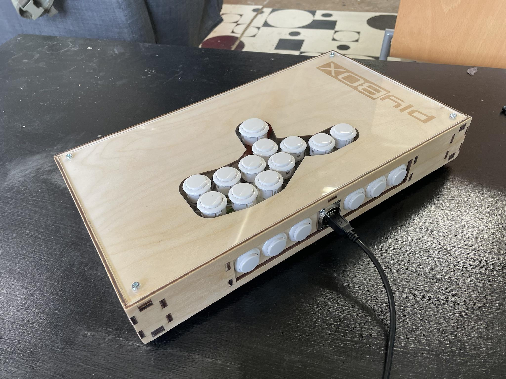

# Plybox — a laser cut plywood hitbox-layout fighting game controller

Plybox is my attempt at producing a low-cost and easy to assemble hitbox-style fighting game controller. Made out of laser cut plywood and acrylic, the materials are relatively inexpensive and easy to acquire, and assembly requires no real woodworking expertise beyond gluing and sanding.

## Equipment & Bill of materials

**For the box, you need:**

- Access to a laser cutter capable of cutting 4mm plywood and 3mm acrylic
- Laser-safe 4mm plywood. I use a 75x75cm sheet of birch plywood, which is more than is necessary (sheet has material left over)
- A 380x210mm piece of 3mm acrylic for the top cover (presumably you will cut this out of a larger sheet)
- 8x M4 nuts and 8x M4 screws
- Wood glue
- Cyanoacrylate or epoxy
- (Optional) 4x rubber feet for the bottom of the case (a 3D-printable foot model is included, but common 3D printing materials have poor traction)

The total cost of materials is somewhere on the order of 10-20€.

**For the components, you'll want:**

- 1x Sanwa OBSF 30mm arcade button, or any other 30mm arcade button capable of attaching to 3mm acrylic
- 15x Sanwa OBSF 24mm arcade button, or any other 24mm arcade button capable of attaching to 3mm acrylic (a version with two extra 24mm buttons is included, should you wish to bind every button on a PS4 controller)
- 1x Neutrik NAUSB-W Reversible USB gender changer & M3 mounting screws and nuts for it
- Some kind of PCB (low-cost recommendation: the [Pico Fighting Board](https://github.com/FeralAI/PicoFightingBoard) or just a naked Raspberry Pi Pico running the [GP2040 firmware](https://github.com/FeralAI/GP2040))
- Wires, 2.8mm female lug connectors (for Sanwa buttons, at least), USB cables

The total cost of components will depend a lot on where you buy from. For the builds I did it was about 70-80€.

At the time of writing, these components are very widely available at various arcade equipment retailers. The design is built around these exact components, so you will likely have to shuffle things around if you substitute them. Webstores that carry these include: [Smallcab.net](https://www.smallcab.net/) (EU France), [Arcade World UK](https://www.arcadeworlduk.com/) (UK), [ArcadeForge](https://arcadeforge.net/) (EU Germany), [ArcadeShock](https://arcadeshock.com/) (US).

## Assembly instructions

**TODO: a more in-depth guide**

1. Cut the schematics on a laser cutter. I do not use any kerf compensation on mine and this results in snugly fitting finger joints, but your laser cutter may be different.
2. Test fit all the parts together without glue to verify the finger joints fit and to get an idea of how it all fits together.
3. Using wood glue, glue 4 nut holder pieces to the bottom side of the undercover piece. Glue the remaining 4 nut holder pieces together with the similarly shaped screw hole pieces. You may glue these by hand without using clamps or jigs, but be careful with the alignment.
4. Attach the back wall button plate to the back wall using the tap joints and wood glue. Clamp together to ensure tight fit (make sure it's the right way around so the Neutrik will fit correctly).
5. Glue the interior vertical support structure together.
6. Wait about 15 minutes for the glue to dry on the parts you just assembled.
7. Using cyanoacrylate (superglue) or epoxy, affix M4 nuts in the hex pocket of each nut holder piece. Be careful not to get glue in the threads.
8. Working around the internal support structure, glue together the rest of the box. I do this by going one side at a time, spreading wood glue on every contact surface as I go. Wood glue sets quite slowly so you have a good 10-20 minutes to do this step. Wipe off any glue residue that gets squeezed out; it's easier to do before it dries.
9. Clamp the box tight from all sides to ensure a good fit. I recommend putting the bottom cover in place during clamping to ensure that it'll still fit after the box is all glued together.
10. Wait at least 15-20 minutes for the glue to dry.
11. Sand and finish to taste.

## Editing the schematics

To edit the CAD files you need [FreeCAD](https://www.freecad.org/). The files were created using FreeCAD 0.20. While they aren't the cleanest or prettiest CAD files out there, they are at least somewhat parameterized. However, don't expect everything to just work with any random values. You will probably have to re-align some things (e.g. finger joints) if you change things like material thickness.

Why FreeCAD? Because it's free and works on my computer. Basically every other CAD suite has draconian licensing terms and works poorly on Linux.

## Licensing

All the files in this repository are licensed under [CreativeCommons Attribution-ShareAlike 4.0 International](https://creativecommons.org/licenses/by/4.0/).
